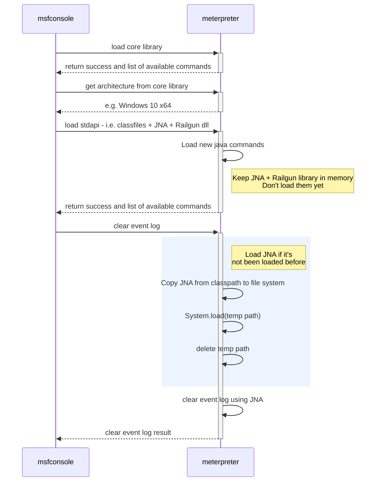
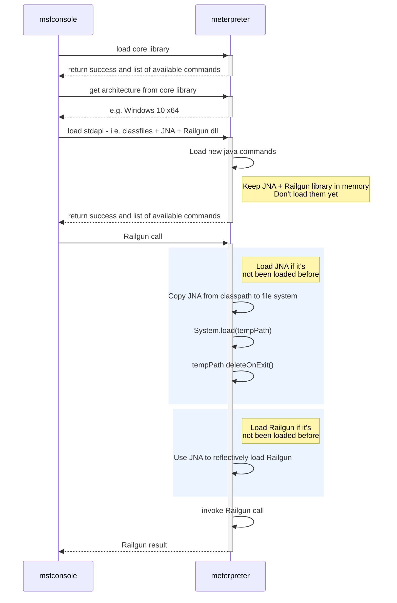
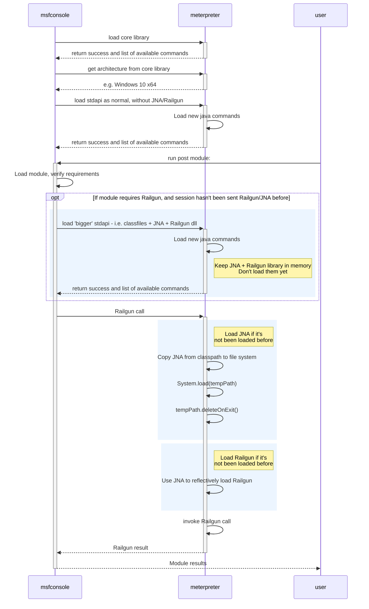

# Java Meterpreter Feature Parity
## Glossary
## Solution Overview
## Implementation
### Supporting native system calls
The sequence of steps required for loading stdapi and invoking clear event log:

### Railgun support
The sequence of steps required for loading stdapi and invoking Railgun:

### Alternative Implementation 1
This would work as follows:

